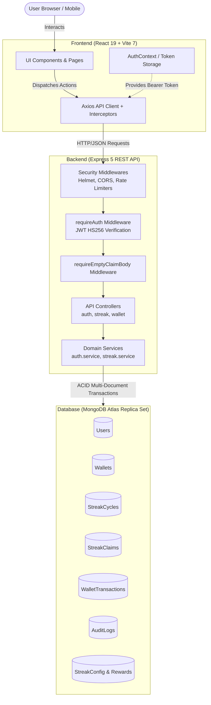
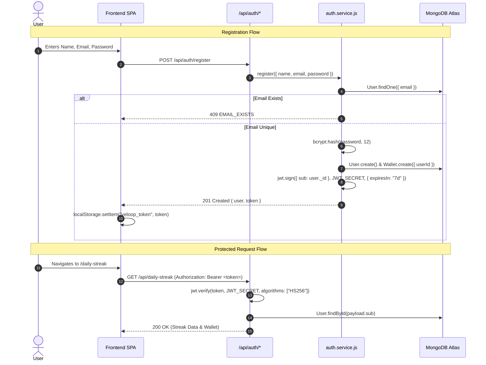
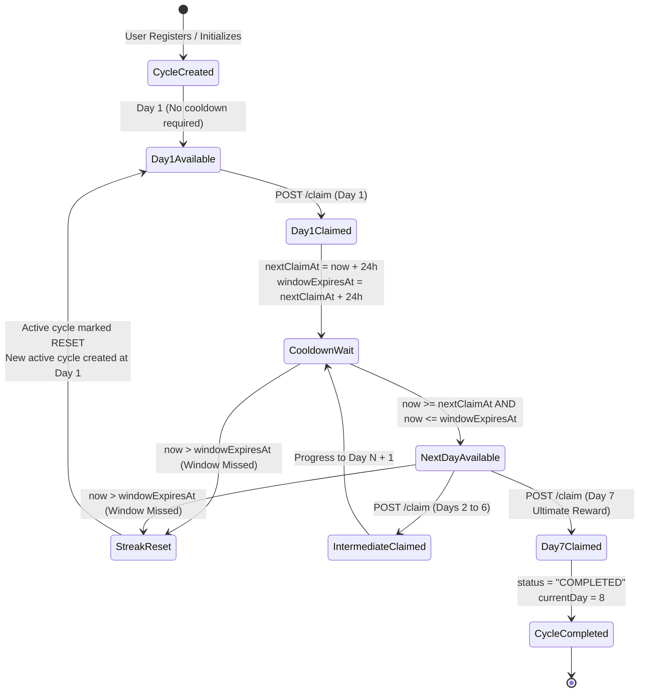
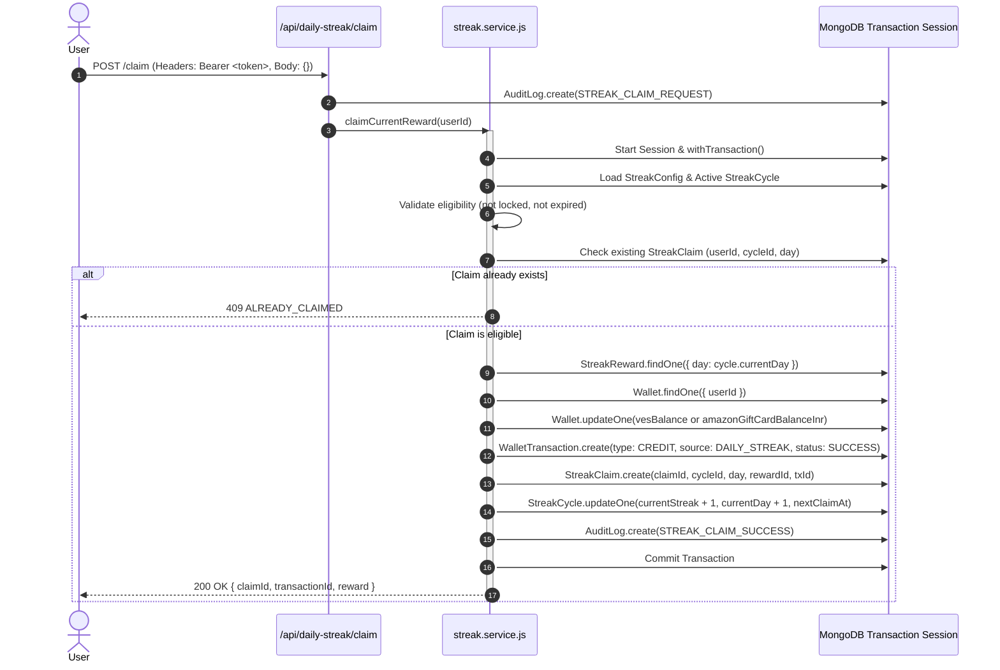
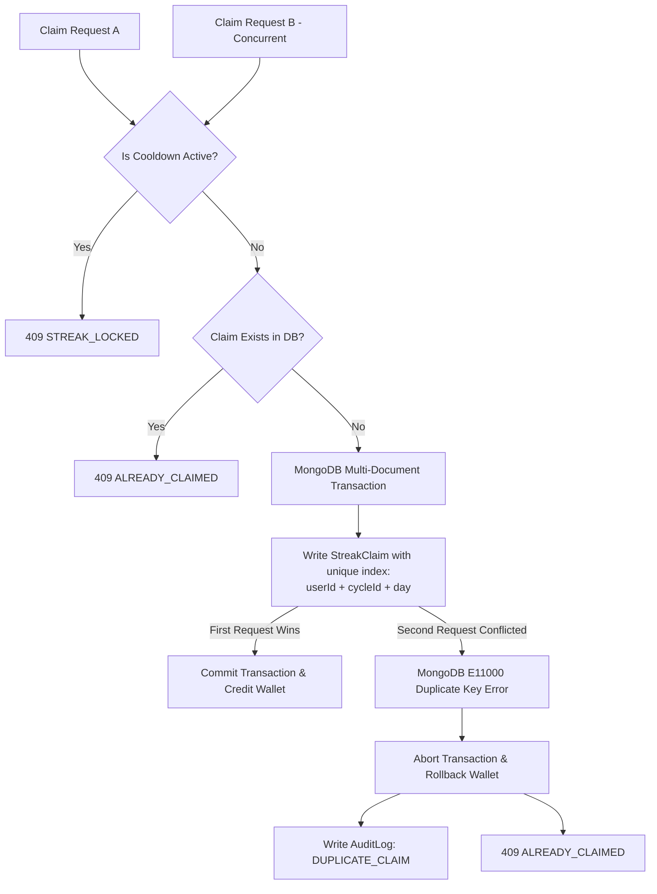

# VELoop Rewards — System Architecture

This document describes the architectural design, component interactions, request lifecycles, transactional boundaries, and security mechanisms of the **VELoop Rewards — Daily Streak** application.

---

## 1. High-Level Architecture Overview

VELoop Rewards follows a modern 3-tier decoupled architecture:
1. **Presentation Layer (Frontend)**: React 19 Single Page Application (SPA) bundled with Vite 7, styled using modular CSS and Bootstrap 5 utilities, deployed on Vercel.
2. **Application & API Layer (Backend)**: Node.js (ES Modules) Express 5 REST API enforcing zero-trust validation, JWT authentication, rate limiting, and security headers, deployed on Render.
3. **Persistence Layer (Database)**: MongoDB Atlas replica set providing multi-document ACID transactions, unique indexes, and schema enforcement through Mongoose 8.



---

## 2. Frontend-to-Backend Request Flow

Every network interaction follows a deterministic path through the application stack:

1. **Client Request Initiation**:
   - The user triggers an action (e.g., claiming a streak or loading the page).
   - An Axios instance configured in `frontend/src/services/api.js` intercepts the outgoing request.
   - The request interceptor inspects `localStorage` for `veloop_token`. If present, it attaches the `Authorization: Bearer <token>` header.

2. **Reverse Proxy & Transport Security**:
   - Express is configured with `app.set("trust proxy", 1)` to handle reverse proxies (Render / Vercel).
   - `helmet()` automatically injects Content Security Policy (CSP), HTTP Strict Transport Security (HSTS), and frame restrictions.
   - `cors(corsOptions)` verifies the `Origin` header against an approved whitelist (`https://ve-loop-daily-streak.vercel.app`, `http://localhost:5173`, and `CLIENT_URL`).

3. **Global Rate Limiting**:
   - Global rate limiter permits up to 300 requests per 15-minute window across `/api/*`.
   - Endpoint-specific limiters apply stricter thresholds: 15 per 15m for auth, 10 per 1m for claim.

4. **Authentication & Identity Resolution**:
   - Protected routes execute `requireAuth` (`backend/src/middleware/auth.middleware.js`).
   - The middleware verifies the JWT against `JWT_SECRET` with explicit `{ algorithms: ["HS256"] }`.
   - It validates that `payload.sub` is a valid MongoDB `ObjectId`.
   - It loads the user record from MongoDB (`User.findById(payload.sub).select("_id name email")`) and binds it to `req.user`.

5. **Client Input Strictness**:
   - On `/api/daily-streak/claim`, `requireEmptyClaimBody` enforces that `req.body` and `req.query` contain **no keys**. Client-provided user IDs, days, or amounts are rejected with `400 UNTRUSTED_CLAIM_INPUT`.

6. **Controller & Service Delegation**:
   - The controller delegates all business logic to domain services (`auth.service.js`, `streak.service.js`).
   - The service coordinates MongoDB queries and transactions.

7. **Response & Session Expiration Handling**:
   - The backend returns standardized JSON responses.
   - If a 401 response is returned, the frontend Axios response interceptor immediately purges `veloop_token` from `localStorage`, causing `AuthContext` to redirect the user to `/login`.

---

## 3. Authentication & Authorization Architecture

Authentication is stateless and cryptographically verified:



### Key Security Guardrails:
- **Anti-Timing Attack Protection**: During login, if an email is not found, `auth.service.js` executes `bcrypt.compare(password, DUMMY_HASH)`. This ensures that invalid emails consume the same computational time as valid emails, thwarting user enumeration attacks.
- **Algorithm Lockdown**: JWT verification explicitly enforces `algorithms: ["HS256"]`, preventing algorithm switching attacks (such as "none" or RS256 confusion).
- **Zero Client Identity Authority**: The client never sends a `userId`. All user-specific database lookups strictly use `req.user._id` derived from the verified token.

---

## 4. Daily Streak Claim Lifecycle & State Machine

The daily streak progression is modeled as a state machine governed by server time:



### Business Rules & Windows:
1. **`claimIntervalHours = 24`**: The mandatory waiting period after claiming Day $N$ before Day $N+1$ unlocks.
2. **`claimWindowHours = 24`**: The window after unlock during which the user must claim Day $N+1$.
3. **Missed Window Expiration**: If `serverTime > cycle.windowExpiresAt`, the cycle transitions to `status: "RESET"` with `resetReason: "REQUIRED_CLAIM_WINDOW_MISSED"`, and a new cycle begins at Day 1.
4. **Day 7 Ultimate Completion**: When Day 7 is claimed, `cycle.currentDay` becomes `8`, `cycle.status` becomes `"COMPLETED"`, and `nextClaimAt` is cleared.

---

## 5. Wallet Credit & Transaction Lifecycle

Every reward claim updates the user's wallet balance and appends an immutable transaction record within a MongoDB multi-document transaction (`session.withTransaction`).



### Transaction Guarantees:
- **Atomicity**: If any operation fails (such as a database disconnection, write conflict, or schema violation), all changes—wallet balance increments, ledger entries, and streak updates—are rolled back completely.
- **Balance Integrity**: The `WalletTransaction` document records both `balanceBefore` and `balanceAfter` alongside the reference ID, ensuring an audit-proof ledger.

---

## 6. Duplicate & Concurrent Claim Prevention

To protect against duplicate claims and race conditions (e.g., automated scripts or double clicks across multiple tabs), the system employs defense-in-depth:



### Idempotency Pillars:
1. **Compound Unique Index on Claims**:
   ```javascript
   streakClaimSchema.index({ userId: 1, cycleId: 1, day: 1 }, { unique: true });
   ```
2. **Partial Unique Index on Active Cycles**:
   ```javascript
   streakCycleSchema.index(
     { userId: 1, status: 1 },
     { unique: true, partialFilterExpression: { status: "ACTIVE" } }
   );
   ```
3. **Database Write Conflict Serialization**: When two requests run simultaneously inside `session.withTransaction`, MongoDB detects write conflicts or throws error code `11000`. The catch block intercepts `11000` and converts it into a clean `409 ALREADY_CLAIMED` response with zero double-crediting.
4. **Client-Side Throttling**: The frontend disables the claim button and displays "Processing..." during claim execution.

---

## 7. Error Handling Architecture

The backend standardizes all API errors through a centralized error handling middleware (`backend/src/middleware/error.middleware.js`):

### Custom `HttpError` Utility
Controllers and services throw structured `HttpError` instances:
```javascript
export class HttpError extends Error {
  constructor(status, message, code = "ERROR", details = null) {
    super(message);
    this.status = status;
    this.code = code;
    this.details = details;
  }
}
```

### Centralized Middleware Behavior:
- Intercepts uncaught errors and logs stack traces to `stderr`.
- Translates MongoDB `code === 11000` duplicate key errors directly to HTTP 409 `{ success: false, code: "DUPLICATE", message: "This operation has already been processed." }`.
- Conceals raw internal database errors or unhandled system exceptions in production by returning a safe HTTP 500 `"Unable to process your request. Please try again."`.
