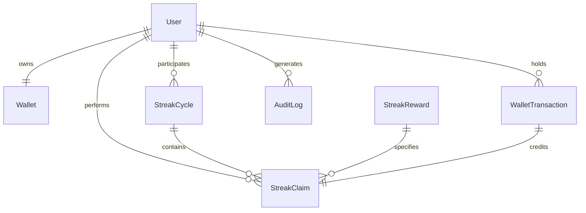

# VELoop Rewards — Database Schema & Data Models

This document provides a comprehensive technical reference for the MongoDB database models, collection schemas, relationships, indexes, and transactional guarantees implemented in the **VELoop Rewards — Daily Streak** backend.

---

## 1. Database Architecture & Engine Requirements

- **Database Engine**: MongoDB Atlas (or MongoDB v4.4+ with replica set enabled)
- **Object-Document Mapper (ODM)**: Mongoose v8.18+
- **ACID Transactions**: Required for daily streak claims and wallet mutations. MongoDB replica sets provide distributed consensus for `session.withTransaction`.
- **Default Database Name**: Configured via connection string in `MONGO_URI` (e.g., `veloop_rewards`).



---

## 2. Collections & Schema Specifications

### 2.1 `User` Collection (`backend/src/models/User.js`)
Stores authentication identities, display names, and password hashes.

| Field | BSON Type | Required | Unique | Validation / Notes |
|---|---|---|---|---|
| `_id` | `ObjectId` | Yes | Yes | MongoDB primary key. |
| `name` | `String` | Yes | No | Trimmed, length: 2 to 80 characters. |
| `email` | `String` | Yes | Yes | Normalized to lowercase, trimmed, indexed. |
| `passwordHash` | `String` | Yes | No | 60-character bcrypt hash (salt cost: 12). |
| `createdAt` | `Date` | Auto | No | Mongoose automatic timestamp. |
| `updatedAt` | `Date` | Auto | No | Mongoose automatic timestamp. |

#### Indexes:
- `{ email: 1 }` (`unique: true`) — Prevents duplicate user registrations.

---

### 2.2 `Wallet` Collection (`backend/src/models/Wallet.js`)
Maintains the current balances for all supported reward currencies. Exactly one wallet exists per registered user.

| Field | BSON Type | Required | Unique | Validation / Notes |
|---|---|---|---|---|
| `_id` | `ObjectId` | Yes | Yes | MongoDB primary key. |
| `userId` | `ObjectId` | Yes | Yes | References `User._id`. Indexed. |
| `vesBalance` | `Number` | No | No | Default: `0`, minimum value: `0`. |
| `amazonGiftCardBalanceInr` | `Number` | No | No | Default: `0`, minimum value: `0`. Represents gift card value in Indian Rupees. |
| `createdAt` | `Date` | Auto | No | Timestamp of wallet creation. |
| `updatedAt` | `Date` | Auto | No | Timestamp of latest balance update. |

#### Indexes:
- `{ userId: 1 }` (`unique: true`) — Guarantees 1-to-1 relationship between `User` and `Wallet`.

---

### 2.3 `WalletTransaction` Collection (`backend/src/models/WalletTransaction.js`)
An immutable financial ledger recording every balance change, the transaction source, streak day, and balance audit trail.

| Field | BSON Type | Required | Unique | Validation / Notes |
|---|---|---|---|---|
| `_id` | `ObjectId` | Yes | Yes | MongoDB primary key. |
| `transactionId` | `String` | Yes | Yes | Unique reference generated as `STREAK-<HEX>`. |
| `userId` | `ObjectId` | Yes | No | References `User._id`. Indexed. |
| `currency` | `String` | Yes | No | E.g., `"VES"` or `"INR"`. |
| `type` | `String` | Yes | No | Enum: `["CREDIT", "DEBIT"]`. |
| `amount` | `Number` | Yes | No | Non-negative numeric value credited or debited. |
| `source` | `String` | Yes | No | Enum: `["DAILY_STREAK"]`. |
| `referenceId` | `String` | Yes | No | External or internal operation identifier. |
| `streakDay` | `Number` | No | No | Associated reward day (1 to 7). Nullable for non-streak transactions. |
| `balanceBefore` | `Number` | Yes | No | Wallet balance prior to transaction. |
| `balanceAfter` | `Number` | Yes | No | Wallet balance after applying transaction. |
| `status` | `String` | No | No | Enum: `["SUCCESS", "FAILED"]`. Default: `"SUCCESS"`. |
| `createdAt` | `Date` | Auto | No | Transaction creation timestamp. |
| `updatedAt` | `Date` | Auto | No | Last modification timestamp. |

#### Indexes:
- `{ transactionId: 1 }` (`unique: true`) — Ledger idempotency.
- `{ userId: 1 }` — Optimizes user transaction history lookups.

---

### 2.4 `StreakConfig` Collection (`backend/src/models/StreakConfig.js`)
Global administrative configuration governing cycle duration, cooldown intervals, and reset policies.

| Field | BSON Type | Required | Unique | Validation / Notes |
|---|---|---|---|---|
| `_id` | `ObjectId` | Yes | Yes | MongoDB primary key. |
| `key` | `String` | No | Yes | Default: `"DAILY_STREAK"`. Unique configuration key. |
| `totalDays` | `Number` | No | No | Default: `7`, min: `1`. Total cycle length. |
| `claimIntervalHours` | `Number` | No | No | Default: `24`, min: `1`. Cooldown period between claims. |
| `claimWindowHours` | `Number` | No | No | Default: `24`, min: `1`. Window after unlock before streak is missed. |
| `resetOnMissedDay` | `Boolean` | No | No | Default: `true`. Controls whether missed window triggers reset. |
| `active` | `Boolean` | No | No | Default: `true`. |
| `createdAt` | `Date` | Auto | No | Creation timestamp. |
| `updatedAt` | `Date` | Auto | No | Last update timestamp. |

#### Indexes:
- `{ key: 1 }` (`unique: true`) — Enforces single configuration per key.

---

### 2.5 `StreakReward` Collection (`backend/src/models/StreakReward.js`)
Configured reward catalog for each day of the streak cycle. Seeded by `backend/seed/streakRewards.js`.

| Field | BSON Type | Required | Unique | Validation / Notes |
|---|---|---|---|---|
| `_id` | `ObjectId` | Yes | Yes | MongoDB primary key. |
| `day` | `Number` | Yes | Yes | Day number (1 to 7). Unique index. |
| `rewardType` | `String` | Yes | No | Enum: `["VES", "AMAZON_GIFT_CARD"]`. |
| `currency` | `String` | Yes | No | `"VES"` or `"INR"`. |
| `amount` | `Number` | Yes | No | Reward quantity (e.g. 5, 10, 1, 2). Min: `0`. |
| `title` | `String` | Yes | No | Display title (e.g. "Daily Reward", "Ultimate Reward"). |
| `subtitle` | `String` | No | No | Display subtitle (e.g. "5 VEs", "₹5 Amazon Gift Card"). |
| `assetType` | `String` | Yes | No | Enum: `["coin", "gift-card", "crown"]`. Controls frontend card art. |
| `active` | `Boolean` | No | No | Default: `true`. |
| `metadata` | `Mixed` | No | No | Default: `{}`. Additional campaign data. |
| `createdAt` | `Date` | Auto | No | Timestamp. |
| `updatedAt` | `Date` | Auto | No | Timestamp. |

#### Seeded 7-Day Configuration:
| Day | Reward Type | Currency | Amount | Title | Subtitle | Asset Type |
|---|---|---|---|---|---|---|
| 1 | `VES` | VES | 5 | Daily Reward | 5 VEs | coin |
| 2 | `VES` | VES | 10 | Daily Reward | 10 VEs | coin |
| 3 | `VES` | VES | 15 | Daily Reward | 15 VEs | coin |
| 4 | `AMAZON_GIFT_CARD` | INR | 1 | Amazon Gift Card | ₹1 Amazon Gift Card | gift-card |
| 5 | `AMAZON_GIFT_CARD` | INR | 2 | Amazon Gift Card | ₹2 Amazon Gift Card | gift-card |
| 6 | `VES` | VES | 30 | Daily Reward | 30 VEs | coin |
| 7 | `AMAZON_GIFT_CARD` | INR | 5 | Ultimate Reward | ₹5 Amazon Gift Card | crown |

#### Indexes:
- `{ day: 1 }` (`unique: true`) — Enforces unique configuration per day.

---

### 2.6 `StreakCycle` Collection (`backend/src/models/StreakCycle.js`)
Tracks the active or past streak progression cycle for a user, including timestamps for eligibility and expiration.

| Field | BSON Type | Required | Unique | Validation / Notes |
|---|---|---|---|---|
| `_id` | `ObjectId` | Yes | Yes | MongoDB primary key. |
| `userId` | `ObjectId` | Yes | No | References `User._id`. Indexed. |
| `cycleNumber` | `Number` | Yes | No | Monotonically increasing sequence (1, 2, 3...). |
| `status` | `String` | No | No | Enum: `["ACTIVE", "COMPLETED", "RESET"]`. Default: `"ACTIVE"`. |
| `currentDay` | `Number` | No | No | Day currently awaiting claim (1 to 7). Set to 8 upon completion. |
| `currentStreak` | `Number` | No | No | Total consecutive claims in this cycle (0 to 7). |
| `lastClaimAt` | `Date` | No | No | Timestamp of the most recent successful claim. |
| `nextClaimAt` | `Date` | No | No | Earliest timestamp when the next claim can occur (`lastClaimAt + 24h`). |
| `windowExpiresAt` | `Date` | No | No | Deadline before the cycle resets (`nextClaimAt + 24h`). |
| `resetReason` | `String` | No | No | Reason code if status changed to `RESET` (e.g. `"REQUIRED_CLAIM_WINDOW_MISSED"`). |
| `createdAt` | `Date` | Auto | No | Cycle initiation timestamp. |
| `updatedAt` | `Date` | Auto | No | Last update timestamp. |

#### Indexes:
- `{ userId: 1 }` — Enables fast user cycle queries.
- `{ userId: 1, status: 1 }` (`unique: true, partialFilterExpression: { status: "ACTIVE" }`) — **Critical**: Guarantees a user can never have more than one `ACTIVE` streak cycle at any given time.

---

### 2.7 `StreakClaim` Collection (`backend/src/models/StreakClaim.js`)
Records every successful reward claim event.

| Field | BSON Type | Required | Unique | Validation / Notes |
|---|---|---|---|---|
| `_id` | `ObjectId` | Yes | Yes | MongoDB primary key. |
| `claimId` | `String` | Yes | Yes | Public claim reference formatted as `CLAIM-<HEX>`. |
| `userId` | `ObjectId` | Yes | No | References `User._id`. Indexed. |
| `cycleId` | `ObjectId` | Yes | No | References `StreakCycle._id`. Indexed. |
| `day` | `Number` | Yes | No | Claimed day number (1 to 7). |
| `rewardId` | `ObjectId` | Yes | No | References `StreakReward._id`. |
| `status` | `String` | No | No | Enum: `["SUCCESS", "REVERSED"]`. Default: `"SUCCESS"`. |
| `claimedAt` | `Date` | Yes | No | Authoritative server timestamp when claim was processed. |
| `transactionId` | `ObjectId` | Yes | No | References `WalletTransaction._id`. Links claim directly to wallet ledger. |
| `createdAt` | `Date` | Auto | No | Record creation timestamp. |
| `updatedAt` | `Date` | Auto | No | Record update timestamp. |

#### Indexes:
- `{ claimId: 1 }` (`unique: true`) — Unique identifier lookup.
- `{ userId: 1 }` — Querying user history.
- `{ cycleId: 1 }` — Querying claims for an active cycle.
- `{ userId: 1, cycleId: 1, day: 1 }` (`unique: true`) — **Critical compound unique constraint**: Mathematically prevents a user from claiming the same day multiple times within a single streak cycle.

---

### 2.8 `AuditLog` Collection (`backend/src/models/AuditLog.js`)
Records security and business events for compliance, fraud detection, and debugging.

| Field | BSON Type | Required | Unique | Validation / Notes |
|---|---|---|---|---|
| `_id` | `ObjectId` | Yes | Yes | MongoDB primary key. |
| `userId` | `ObjectId` | No | No | References `User._id`. Null for unauthenticated requests. |
| `event` | `String` | Yes | No | Enum: `["STREAK_CLAIM_REQUEST", "STREAK_CLAIM_SUCCESS", "STREAK_CLAIM_REJECTED", "STREAK_RESET", "DUPLICATE_CLAIM", "INVALID_CLAIM"]`. |
| `metadata` | `Mixed` | No | No | Contextual metadata (e.g. cycle IDs, reject reasons, payload tampering flags). |
| `ip` | `String` | No | No | Request client IP address. |
| `createdAt` | `Date` | Auto | No | Event logging timestamp. |
| `updatedAt` | `Date` | Auto | No | Timestamp. |

#### Indexes:
- `{ userId: 1 }` — Audit filtering by user.

---

## 3. ACID Multi-Document Transactions

All balance credits and claim registrations execute inside an explicit MongoDB transaction:

```javascript
const session = await mongoose.startSession();
try {
  await session.withTransaction(async () => {
    // 1. Fetch active cycle and reward configuration
    // 2. Validate unlock time (now >= nextClaimAt)
    // 3. Increment Wallet balance (vesBalance or amazonGiftCardBalanceInr)
    // 4. Create WalletTransaction ledger entry
    // 5. Create StreakClaim record
    // 6. Update StreakCycle state (currentStreak, currentDay, nextClaimAt, windowExpiresAt)
    // 7. Write AuditLog entry (STREAK_CLAIM_SUCCESS)
  });
} finally {
  await session.endSession();
}
```

### Rollback Triggers:
- Any unhandled exception or explicit `HttpError` thrown within the transaction callback triggers an automatic rollback of all modified documents.
- If a duplicate claim attempt causes a MongoDB duplicate key error (`11000`) on `{ userId: 1, cycleId: 1, day: 1 }`, the transaction is aborted immediately, preventing any wallet credit.
